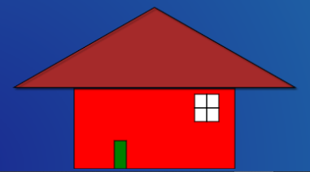
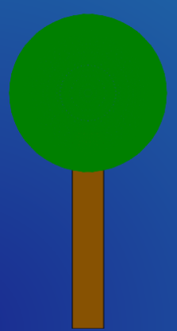
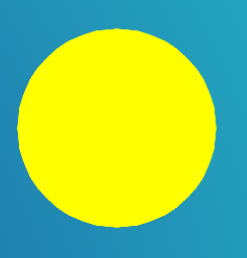
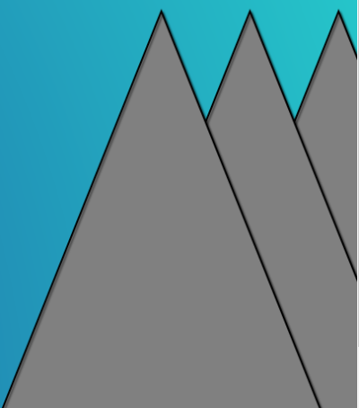
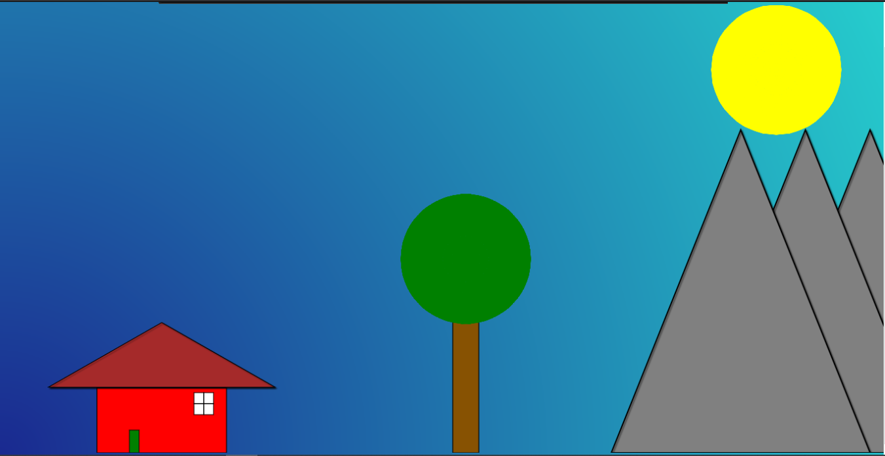

## Générateur de paysages

Projet de développement logiciel à destinatation d'apprentis développeur.
Les membres du groupe sont Théo Angeles et Vincent Aupee.

### Analyse du code

#### index.html

La barre de menu contient une liste déroulante présentant les composants de forme :

```html
<li><a class="hsubs" href="#">Composant</a>
      <ul class="subs">
        <li><a href="#" onclick="drawForm('Maison');return false;">Maison</a></li>
        <li><a href="#" onclick="drawForm('Arbre');return false;">Arbre</a></li>
        <li><a href="#" onclick="drawForm('Soleil');return false;">Soleil</a></li>
        <li><a href="#" onclick="drawForm('Montagne');return false;">Montagne</a></li>
      </ul>
    </li>
```

Lorsque un utilisateur clique sur un des choix déroulant cela fera
appel à la fonction `drawForm`.

```javascript
  function drawForm(form) {
    document.drawForm(form)
  }
``` 
Dans le fichier `main.js` la fonction `drawForm` 
est une allusion à la fonction  `drawThisForm` du module `main.js` qui à était importé juste avant.
  

###Création d'un nouvelle objet

Pour pouvoir créer un nouvel objet, il faut créer le fichier qui va lui correspondre, c'est ce fichier qui va définir ses caractéristiques. Ici on utilise le fichier `Arbre.js` comme exemple. Tout d'abord nous importons les différentes classes que nous aurons besoins. 
Pour l'arbre, nous avons besoins d'un rectangle et de cercle , que l'on peut créer a partir de la classe "Planete.js".

```javascript
import {AbstractForm} from './AbstractForm.js';
import {Feuille} from './Feuille.js';
```
Nous définissons les différentes variables de notre nouvelle classe `Arbre`.
Notre classe `Arbre` hérite de notre classe `AbstractForm`, on doit alors définir toutes les variables de `AbstractForm` et les variables spécifiques à notre classe Arbre. la variable feuille n'existe pas dans AbstractForm, nous la définissons donc dans notre constructeur et grâce à la ligne `this.feuille = feuille`.

```javascript
class Arbre extends AbstractForm {
    
}
    constructor(
        x = 0,
        y = 0,
        width = 0,
        height = 0,
        fillColor = '',
        strokeColor = '',
        strokeWidth = 2,
        pesanteur = false,
        feuille


    ) {
        super(x, y, width, height, fillColor, strokeColor, strokeWidth, pesanteur)
        this.feuille = feuille

    }
```
Nous devons ensuite créer la fonction draw(). Cette fonction est la fonction permettant de dessiner les objets que nous définissons.
```javascript
draw(ctx) {

        // saves the current styles set elsewhere
        // to avoid overwriting them
        ctx.save()

        // set the styles for this shape
        ctx.fillStyle = this.fillColor
        ctx.lineWidth = this.strokeWidth

        // create the *path*
        ctx.beginPath()
        ctx.strokeStyle = this.strokeColor
        const MAX_HEAD = 0
        let new_y = (this.pesanteur) ? window.innerHeight - this.height - MAX_HEAD : this.y


        ctx.rect(this.x, new_y, this.width, this.height)
        // draw the path to screen
        ctx.fill()
        ctx.stroke()

        // restores the styles from earlier
        // preventing the colors used here
        // from polluting other drawings
        ctx.restore()

        // Feuille
        this.feuille.draw(ctx)
    }
```
L'expression `ctx.rect` permet de définir notre objet comme un rectangle, puis de définir ses variables 'géométrique' , this.width et this.height étant sa largeur et sa hauteur.
```javascript
// Feuille
static buildForms() {

        const myFeuille = new Feuille(100, 500, 100, 100, 'green', 'green', 1, false )
        const forms = [myFeuille]
        return forms
    }
```
Cet extrait de code nous permet de dessiner une autre forme qui n'est pas notre forme principales , les feuilles vont se mettre sur l'arbre.
```javascript
arbre(){

        const feuilleY =  window.innerHeight - this.height - 400
        const feuille = new Feuille (70, feuilleY, 200, 200, 'green', 'green', 1, false )
        const arbre = new Arbre(150 , 50 , 40 , 250 , "#875202" , "", 0 , true, feuille)

        return arbre
    }
```
On définit nos variables , ici la constante `feuilleY` pour la hauteur car la pesanteur et en false. 
Ensuite on crée la variable `feuille` pour crée nos feuilles. Et enfin la constante `arbre` pour notre arbre.
On retourne donc `arbre` à la fin.
```javascript
static buildForms() {

        const bld = new Arbre()
        let forms = []

        forms.push( bld.arbre() )
        const builds = forms
        return builds
    }
}
export {Arbre}

```
Le buildForms est une fonctions utilisé dans le code, qui nous permet de transmettre un objet de notre page Arbre à la fonctions permettant de dessiner nos objet. Ils ne nous reste plus qu'a exporter notre classe Arbre.

### Ajouter une nouvelle classe de forme

Une fois le fichier comportant la nouvelle Classe créer, il faut importer les classes dont on va avoir besoin, grâce au code ci dessous :
```javascript
import {Maison} from './modules/Maison/Maison.js';
import {Arbre} from './modules/Maison/Arbre/Arbre.js';
import {Soleil} from './modules/Maison/Soleil.js';
import {Montagne} from './modules/Maison/Arbre/Montagne.js';
```
Il faut ensuite modifier le fichier `main.js` afin de permettre de dessiner les nouvelles formes.
Dans un premier temps, on complète la fonction buildForms() pour chaqu'une de nos classes.


```javascript
function buildForms() {
    
  let forms = Maison.buildForms()
  forms = forms.concat(Soleil.buildForms())
  forms = forms.concat(Montagne.buildForms())
  forms = forms.concat(Maison.buildForms())
  forms = forms.concat(Arbre.buildForms())
```
On modifie ensuite la fonction drawThisForm() afin de permettre de dessiner nos nouvelles formes.
```javascript
function drawThisForm(whichForm) {
  if (whichForm === 'Maison') {
    _drawForms(Maison.buildForms())
  }  else if (whichForm === 'Arbre') {
    _drawForms(Arbre.buildForms())
  }  else if (whichForm === 'Soleil') {
    _drawForms(Soleil.buildForms())
  } else if (whichForm === 'Montagne') {
    _drawForms(Montagne.buildForms())
```
Une fois le fichier `main.js` modifié, il faut se pencher sur le fichier `index.html`. Il faut ajouter une ligne pour chaque nouvelles classe d'objet que l'on ajoute.

```html
    <li><a class="hsubs" href="#">Composant</a>
      <ul class="subs">
        <li><a href="#" onclick="drawForm('Maison');return false;">Maison</a></li>
        <li><a href="#" onclick="drawForm('Arbre');return false;">Arbre</a></li>
        <li><a href="#" onclick="drawForm('Soleil');return false;">Soleil</a></li>
        <li><a href="#" onclick="drawForm('Montagne');return false;">Montagne</a></li>
      </ul>
    </li>
```

<hr>

#Annexe

Objectifs  

Nos objectifs au cours de ce projet étaitent les suivants :
* Prise en main du language javascript.
* Développement en javascript dans une approche objet et événementielle.
* Utilisation de l'API 2D JS intégrée.
* Développement de la créativité.

### Squelette de l'application


#### structure des dossiers

```
.
├── css
│   ├── lavalamp.png
│   ├── layout.css
│   ├── menu_bg.png
│   ├── menu.css
│   └── menu_line.png
├── docs
│   ├── analyse.dia
│   ├── analyse.png
│   ├── java-genPaysageEtudiant.zip
│   └── java-paysage-virutel.png
├── index.html
├── js
│   ├── main.js
│   └── modules
│   ├── Maison
│       ├── AbstractForm.js
|       ├── Soleil.js
│       ├── Porte.js
|       |── Maison.js
|       |── Toit.js
|       |── Fenetre.js
│           ├── Paysage
|               |── AbstractForm.js
|               |── Arbre.js
|               |── Feuille.js
|               |── Montagne.js
|               |── Montagne2.js
|               |── Montagne3.js

└── README.md
```

* `index.html` : le point d'entrée de l'interprétation par un navigateur. Hormis les inclusion `css`, 
ce fichier contient quelques instructions `javascript` faisant appel à des fonction de `main.js`
* `css` : l'application utilise le template : http://www.script-tutorials.com/pure-css3-lavalamp-menu/
* `main.js` : déclare utiliser des modules (des classes `js`) et définit 2 fonctions : ̀

```javascript 
function drawThisForm(whichForm) {
  if (whichForm === 'Maison') {
    _drawForms(Maison.buildForms())
  }  else if (whichForm === 'Arbre') {
    _drawForms(Arbre.buildForms())
  }  else if (whichForm === 'Soleil') {
    _drawForms(Soleil.buildForms())
  } else if (whichForm === 'Montagne') {
    _drawForms(Montagne.buildForms())

function drawAllForms () {
  _drawForms(buildForms())
}
```

le dossier `modules` : il contient le code source de classes javascript. C'est dans ce dossier 
que l'on place nos classes représentant les nouvelles formes . 

* `AbstractForm.js` : c'est la classe de base des formes à venir (plusieurs sont fournies en exemple)
* `Immeuble.js` et `Triangle.js` sont des exemples.
* `Maison.js`, `Arbre.js`, `Soleil.js` et `Montagne.js` sont nos créations


###Captures d'écran :

Différentes formes crées :
















